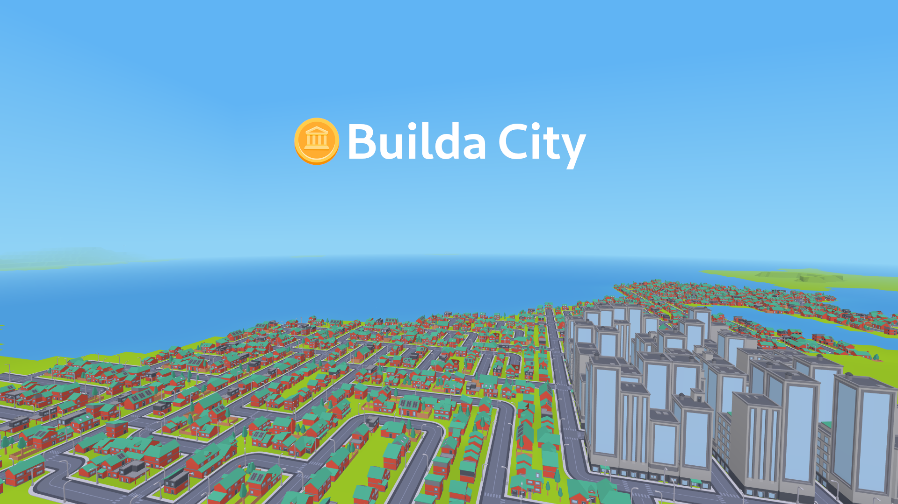

# Builda City™

A multiplayer city-building game running on the Minetest Engine.

## Quick Rundown
You've been employed by a company with plenty of energy to
sell but no customers to sell it to! It's your job
to build a city for them so that they can make some cash!

## Quick Start
You have a limited amount of energy, so it's important to find 
some energy sources. Click on the energy sources to replenish your 
energy. The next step is to builda city. You can only build roads 
and buildings next to existing roads so you will need to find a road. 
Buildings consume energy and eventually they run out and need to be 
charged up, click on a building to charge it. You will collect 
coins this way. Use these coins to fix broken energy sources 
so that you can survive and expand your city!

## Assets
The assets for this game have been sourced from various CC0 sources.
The houses, buildings and roads are by Kenny [https://kenney.nl]. 
The sounds have been sourced from Freesound [https://freesound.org].
The icons are emojis from Twemoji [https://twemoji.twitter.com].

The wind turbine is made by me using AssetForge [https://assetforge.io/].

## Features Wishlist / Roadmap / Ideas
A list of features that would be nice to have, if you are
a modder, submit a PR!
* Traffic
* Airports
* Railroads
* Ports/Ships
* Upgradable Crafts
* Disasters
* Farms/Industry
* Smoother Coastlines
* Mesecon-style power?
* Bridges, Tunnels and Hilly Roads
* Population and City Names
* Driving around the city in a car.
* Walking around the city as a person?

## Minetest Engine Wishlist
If you work on the Minetest engine, here are some feature
that would help to polish & improve Builda City.
* Meshlike particles
* Change the chat/log/debug position
* Use the game name in the pause menu.
* Allow games to incoperate custom menu.
* Automatically load clientmods in the game directory 
  (for singleplayer) if provided.

## License
This project is licensed under the The Qlovatech Community Trademark License 1.0
this means you can do what you like with this project as long as you share your 
changes and respect the community trademarks. See the https://qlova.tech/ctl/1.0